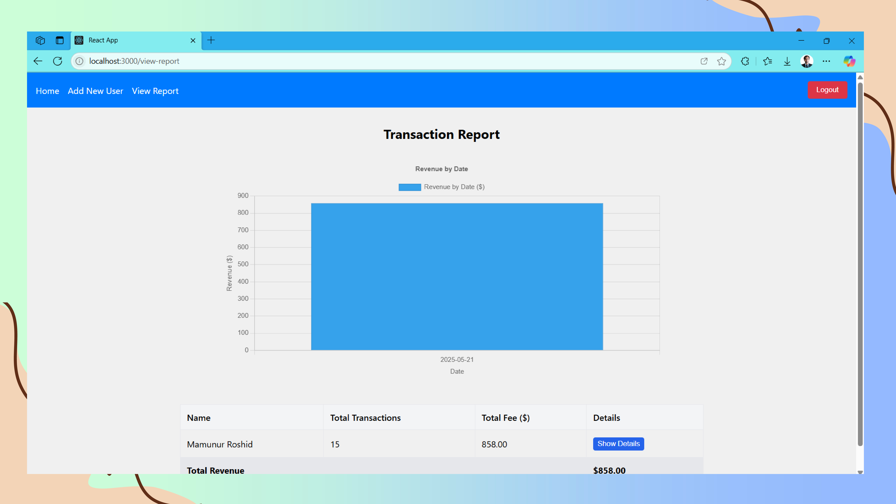

# 🚗 Smart Car Parking System

An IoT-based smart car parking system that automates vehicle entry and provides real-time monitoring of parking slot availability. Built using **ESP32**, **RFID**, **IR sensors**, and **Firebase**, this project offers a seamless parking experience through integrated **web** and **Android** apps.

---

## 📌 Features

* 🔒 **RFID-based Secure Entry**
  Only authorized RFID cards can access the parking area.

* 🚧 **Automated Gate Control**
  Servo motor-controlled barrier opens/closes based on authentication.

* 📍 **Accurate Slot Detection**
  IR sensors connected via a 74HC4067 multiplexer track slot availability.

* 📊 **Real-time Slot Monitoring**
  Parking status updates instantly across:

  * 20x4 LCD display
  * Web dashboard
  * Android app

* ☁️ **Firebase Integration**
  Real-time database used for:

  * Synchronizing hardware states
  * Logging user access and slot transactions

---

## 🛠️ Hardware Components

| Component         | Description                      |
| ----------------- | -------------------------------- |
| ESP32 Dev Board   | Central microcontroller          |
| RC522 RFID Reader | For vehicle authentication       |
| IR Sensors        | To detect car presence in slots  |
| 74HC4067 MUX      | For managing multiple IR sensors |
| Servo Motor       | To control entry gate            |
| 20x4 LCD Display  | For local parking status display |
| Power Supply      | Ensures stable system operation  |

---

## Screenshots

